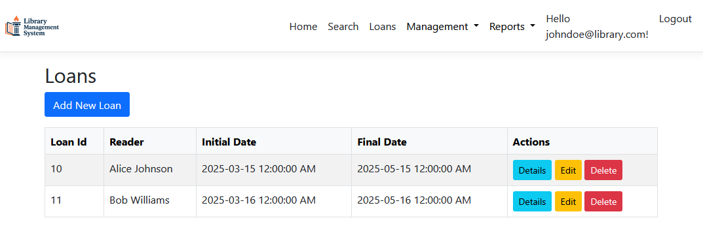
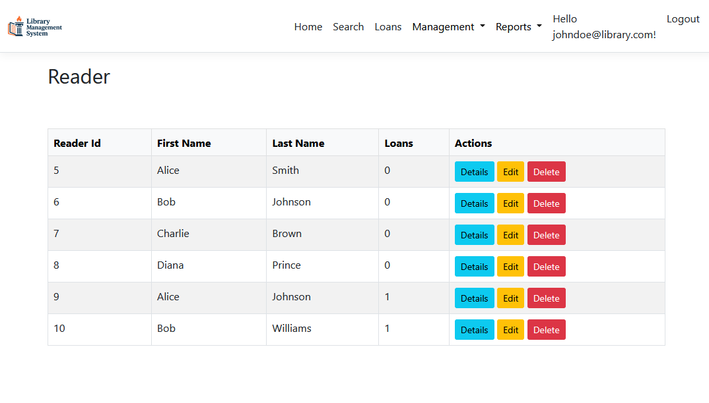
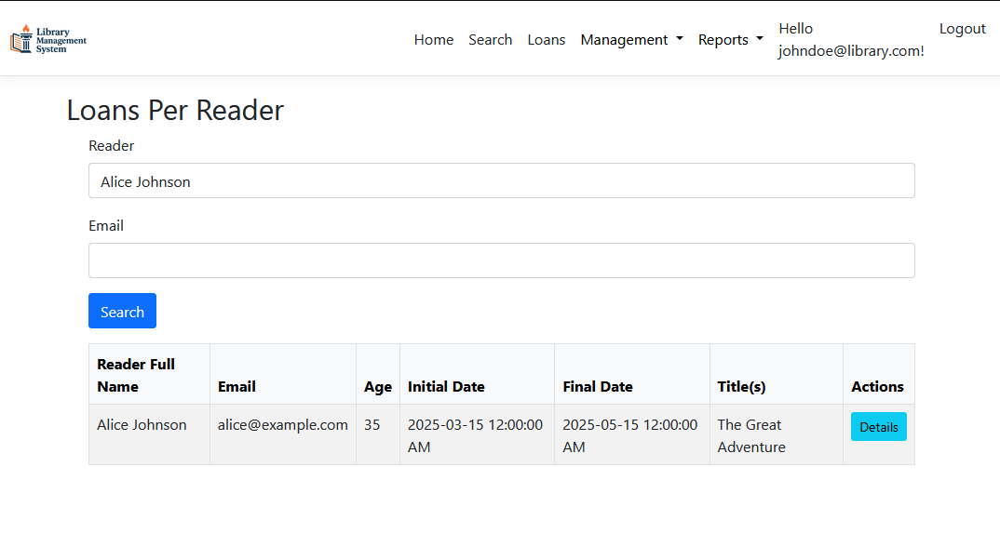
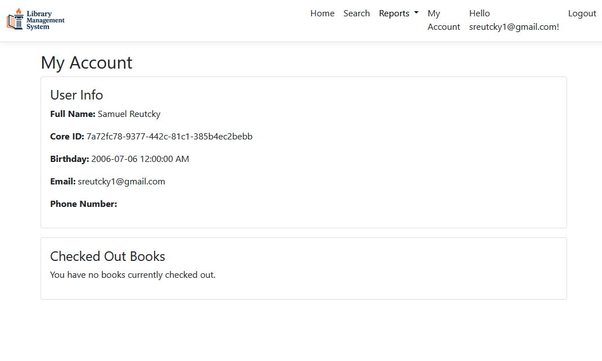
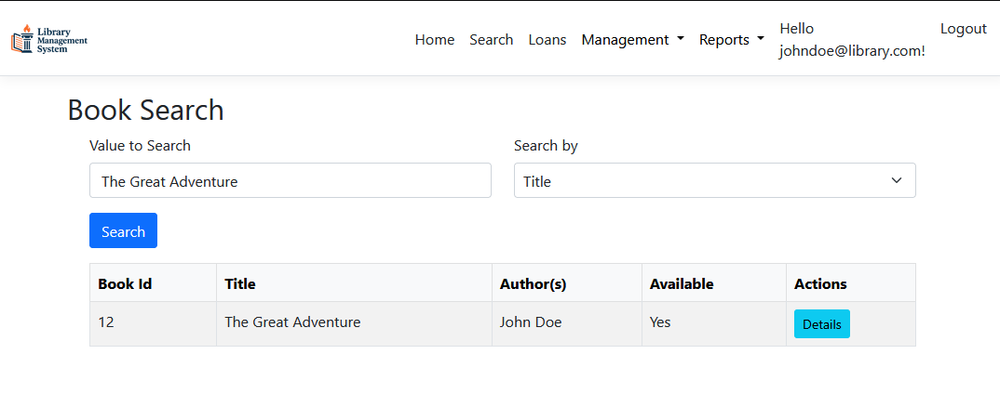
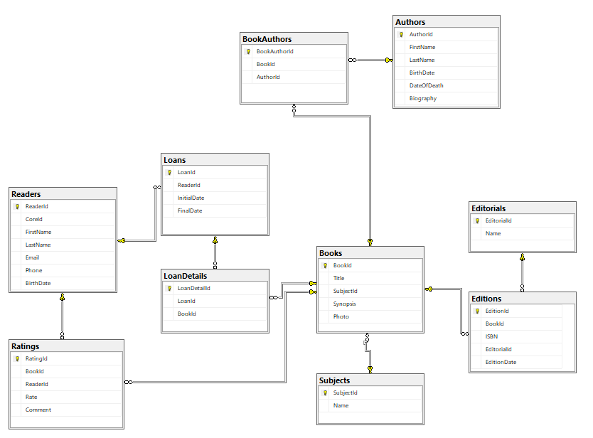

# Library Management System (LMS)

## Overview
The **Library Management System (LMS)** is a web-based application designed to help libraries efficiently manage books, users, borrowing records, and overdue book reports. The system provides functionalities for librarians to oversee inventory and for users (readers) to search, borrow, return, and review books.

## Development Team
Sukhjinder, Fabian, Samuel, Duan.

## Key Features
- **User Authentication & Role Management**: Secure login with roles for **Librarians** (manage inventory, users) and **Readers** (borrow, review books).
- **Book Management**: CRUD operations (Add, Edit, Delete, Search) with categorization by subject, author, availability, and rating.
- **Borrow & Return Books**: Track loan durations and automate due date calculations.
- **Fine Calculation**: Automated fines for late returns.
- **Book Reviews & Ratings**: Users can rate and review books; system displays popular books based on ratings.
- **Statistics & Reports**: Generate reports for most borrowed books, overdue books, and user activity.

## Database Schema
The system uses the following tables:
- **Author**: Stores author details.
- **Subject**: Categorizes books by subject.
- **Book**: Contains book information (ISBN, name, synopsis, etc.).
- **BookAuthor**: Maps books to authors (many-to-many relationship).
- **User**: Stores user details (readers and librarians).
- **Editorial**: Tracks publishing companies.
- **Edition**: Manages book editions.
- **Loan**: Records book loans.
- **LoanDetail**: Tracks individual books within a loan.
- **Rating**: Stores user ratings and reviews for books.

## Technology Stack
- **Frontend**: ASP.NET MVC, Razor Pages, Bootstrap
- **Backend**: ASP.NET Core, C#
- **Database**: SQL Server
- **Authentication**: Identity Framework (JWT-based authentication)

## Installation
1. **Prerequisites**:
   - .NET Core SDK
   - SQL Server
   - Visual Studio (recommended)

2. **Setup**:
   - Clone the repository.
   - Restore NuGet packages.
   - Update the connection string in `appsettings.json` to point to your SQL Server instance.
   - Run database migrations to create the schema.
   - Start the application.

3. **Default Accounts**:
   - Librarian: `admin@library.com` (password: Admin123!)
   - Readers: Register an account using the registration function.

## Usage
- **Librarians**: Log in to manage books, users, and view reports.
- **Readers**: Log in to search, borrow, return, and review books.

## What can Librarians do!
- View and Edit all Loans

- View and Edit all Readers

- Serach the Database for any Loan

## What can Readers Do!
- Use the My Accont Page

- Search for any Book In the Database

- Have a specific page to look at their Loans

## ER Diagram

